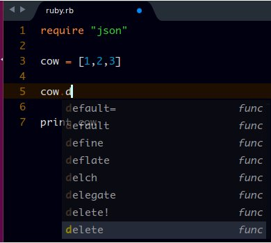
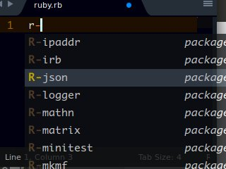

# Ruby Completions

## About
This Sublime Text (2 or 3) package gives method completion suggestions for Ruby.

## How to Use

### Methods

Just type the words and the completion suggestions should show up. Press `ENTER` or `TAB` for completion.




### requiring packages/gems files
Type **R-**`package/gem name` then Press `ENTER` or `TAB` for completion. e.g.

> r-json to get:

```ruby
  require "json"
```




## Contributing

All contributions are welcome. Just fork it on [Github](https://github.com/tushortz/Ruby-Completions) and create a pull request.

## License

© 2015 Taiwo Kareem | taiwo.kareem36@gmail.com.

**Read license.txt**